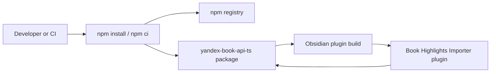

## Context

The plugin already imports `yandex-book-api-ts` in `src/obsidian/yandex-client.ts`, `src/providers/yandex.ts`, and `src/compatibility/yandex-runtime.ts`. Its `package.json` currently resolves that package from the repository-local `yandex-book-api-ts-0.0.3.tgz` archive, so clean installs depend on a checked-in binary artifact instead of the npm registry.

The change affects dependency acquisition only. The existing package boundary, TypeScript imports, Yandex API adapter, and runtime behavior remain in place.

The currently in-force architectural decisions are ADR-0002, ADR-0003, ADR-0004, ADR-0005, ADR-0006, and ADR-0007. ADR-0003 requires the plugin to consume the upstream-owned client rather than vendor or fork it; this design continues that decision while changing only how the upstream package is obtained. ADR-0005 keeps the package behind the provider adapter boundary, and the remaining decisions are unaffected.

### Lightweight Container View

The registry is involved during installation; the built plugin continues to use the resolved package through the same existing import boundary at runtime.

## Goals / Non-Goals

**Goals:**

- Resolve `yandex-book-api-ts` from its published npm package rather than a local archive.
- Keep `package-lock.json` authoritative for repeatable installs after the migration.
- Remove the obsolete local archive when the registry dependency is verified.
- Preserve the existing package API usage and Yandex Books behavior.
- Keep the dependency migration compatible with the existing build, test, and release checks.

**Non-Goals:**

- Changing Yandex API calls, provider behavior, or import semantics.
- Replacing the upstream client, vendoring its source, or adding a local wrapper.
- Introducing runtime package loading or a new provider extension mechanism.
- Changing the plugin's credential, note, or compatibility architecture.

## Decisions

### Use the published npm package

Replace the `file:./yandex-book-api-ts-0.0.3.tgz` dependency with the published `yandex-book-api-ts` package using the standard npm dependency workflow.

**Why:** The package is already the upstream-owned client selected by ADR-0003. Registry resolution removes repository coupling without changing the package boundary.

**Alternatives considered:**

- Keep the local tarball: rejected because it preserves the checked-in artifact dependency.
- Vendor or fork the package source: rejected because it violates upstream ownership and creates a second maintenance source.
- Install from a git repository: rejected because the requested distribution is the published npm package and registry metadata is the intended release contract.

### Commit the registry resolution in the lockfile

Update `package-lock.json` through npm so the selected published package version and integrity metadata are recorded.

**Why:** A registry range can receive future compatible releases, while the lockfile keeps CI and clean installs on the version verified by this change.

**Alternative considered:** Manually editing the lockfile: rejected because npm must calculate package metadata, dependency relationships, and integrity values.

### Remove the local archive after verification

Delete `yandex-book-api-ts-0.0.3.tgz` once package installation, type checking, tests, build, and release verification succeed without it.

**Why:** Leaving the archive would preserve an unused distribution path and make it unclear which dependency source is authoritative.

**Alternative considered:** Retain the archive as an offline fallback: rejected for this change because it would keep the old installation contract and hide accidental local-file dependencies.

### Keep source imports unchanged

Do not modify the existing TypeScript imports or adapter interfaces unless the published package exposes an incompatibility that is proven by verification.

**Why:** The requested change is dependency source migration, not an API integration change. Avoiding source edits minimizes regression risk and preserves the existing ADR-0005 boundary.

## Risks / Trade-offs

- [Published package unavailable or inaccessible during install] -> Require npm registry access for clean installs and report installation failure clearly; retain the lockfile for deterministic retries once access is restored.
- [Published package metadata or resolved version differs from the local archive] -> Inspect the installed package and run typecheck, tests, build, and release verification before removing the archive.
- [A broad dependency range permits future API drift] -> Commit the exact resolved version and integrity data in `package-lock.json`; upgrade separately from this migration.
- [Existing offline workflows rely on the archive] -> Treat offline installation from the checked-in archive as intentionally removed and document registry access as a prerequisite.

## Migration Plan

1. Run `npm install yandex-book-api-ts` from the repository root, allowing npm to replace the local file dependency and update `package-lock.json`.
2. Confirm the dependency is represented as a registry package and that the existing source imports still typecheck.
3. Run the project verification suite: typecheck, lint, tests, build, and release verification.
4. Remove `yandex-book-api-ts-0.0.3.tgz` only after verification passes.
5. Re-run the verification suite after archive removal and inspect the final dependency diff.

Rollback is to restore the previous `package.json`, `package-lock.json`, and local archive until the registry dependency issue is resolved. No application data or persisted note format migration is required.

## Open Questions

- Confirm during implementation which published package version `npm install yandex-book-api-ts` resolves to and that it provides the API surface used by the current source.
- Confirm whether any external release process intentionally depends on the local archive before deleting it.
