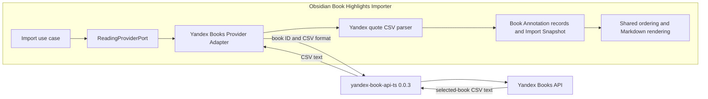

## Context

The Yandex Books **Provider Adapter** currently calls `getProfile()`, pages through account-wide `getUserQuotes()` results, detects ambiguous page overlap, and filters quotes by `quote.book.uuid`. This protects **Import Snapshot** completeness but performs unnecessary account-wide work after the user has already selected one book.

`yandex-book-api-ts` 0.0.3 adds `exportBookQuotes(bookId, "csv")`, which returns one selected book's export as text. The observed export has six columns: `book_title`, `book_authors`, `content`, `comment`, `color`, and `created_at`. Values may contain Unicode, commas, escaped quotes, empty comments, and embedded newlines. Creation times include numeric UTC offsets; the export has no stable quote identifier or reading position.

The in-force architecture constraints are ADR-0002 through ADR-0006. ADR-0001 is fully superseded by ADR-0005 and ADR-0006. This design keeps endpoint ownership in the upstream package (ADR-0003), translates provider data inside the adapter boundary (ADR-0005), and relies on complete **Managed Section** replacement when per-annotation identities are unavailable (ADR-0004).

- The import use case and provider-neutral port do not change.
- The upstream client remains responsible for HTTP endpoint and transport behavior.
- Provider-specific CSV decoding remains inside the Yandex integration boundary.
- Only normalized **Book Annotation** records cross into shared ordering and rendering.

## Goals / Non-Goals

**Goals:**

- Replace account-wide quote pagination with one selected-book CSV export and no fallback path.
- Parse the complete export before returning annotations, accepting additive columns while rejecting missing required columns or malformed CSV.
- Preserve highlights, attached comments, Unicode, escaped CSV values, and embedded line breaks.
- Convert valid timezone-bearing creation times to epoch seconds so shared ordering renders older annotations first.
- Preserve export row order for equal or unavailable timestamps and retain duplicate rows without inventing identities.
- Document the provider format with a synthetic fixture that contains no real user data.
- Verify the new package method through unit, Obsidian transport, desktop, and mobile compatibility coverage.

**Non-Goals:**

- Importing or rendering Yandex highlight colors.
- Replacing selected library title or author metadata with repeated export values.
- Incremental per-annotation synchronization, stable anchors, or synthetic source identifiers.
- Retaining `getUserQuotes()` as a fallback or supporting account-wide quote imports.
- Changing shared import UI, note ownership markers, or another **Reading Provider**.

## Decisions

### Use the per-book export as the sole quote source

`YandexClient` will add `exportBookQuotes(bookId, "csv"): Promise<string>`. `fetchAnnotations()` will call it with the selected `ProviderBook.bookId` and will no longer look up the profile or page through `getUserQuotes()`. `getProfile()` remains in the client contract because credential testing still uses it.

The rejected alternative is to fall back to account-wide pagination when export fails. A fallback would preserve two retrieval and validation paths, make failures dependent on path selection, and retain the incomplete-pagination risks this change removes. Export failures will instead use the existing safe provider-error mapping.

### Isolate a provider-local CSV parser without adding a dependency

A focused module under `src/providers/` will parse Yandex quote exports for both the adapter and compatibility diagnostics. It will expose provider-specific rows containing the six known string fields while ignoring unknown columns after structural validation.

The parser will process the text as an RFC 4180-style state machine. It will support comma delimiters, doubled quote escapes, quoted newlines, LF and CRLF records, an optional UTF-8 byte-order mark, and a trailing record terminator. It will reject invalid quote transitions, duplicate or missing required headers, and rows whose field count does not match the header. The complete parse must succeed before rows are mapped, so a valid prefix can never become a partial snapshot.

A generic CSV dependency was considered but rejected because only one bounded provider format is needed and an additional runtime package would increase bundle and maintenance cost. Splitting text on lines or commas was rejected because the observed export contains quoted commas and embedded newlines.

### Map only provider-neutral annotation data

After a successful parse, the adapter will map `content` and `comment` through the existing text sanitation policy and exclude rows where both normalize to blank. The data-row ordinal becomes `inputIndex`, including gaps left by excluded rows, so row order remains deterministic. `created_at` becomes `createdAt` when valid. `book_title`, `book_authors`, and `color` are validated as present columns but are not copied into the snapshot.

The selected library `ProviderBook` remains authoritative. `progress`, location, section, and `sourceKey` stay absent because the export does not provide trustworthy values. Identical importable rows remain separate **Book Annotation** records.

Synthesizing a hash identifier was rejected because content, comments, and timestamps can change and identical records can legitimately coexist. A generated identity would create false deduplication or unstable update semantics.

### Parse creation times strictly and reuse shared ordering

The timestamp parser will accept the observed `YYYY-MM-DD HH:mm:ss +HHMM` shape, validate calendar and offset components, convert the explicit offset to an absolute epoch value, and store epoch seconds. Blank or invalid values will omit `createdAt` rather than fail otherwise valid annotations.

The shared `orderAnnotations()` policy already sorts finite `createdAt` values ascending, places missing values after finite values, and uses `inputIndex` as the final tie-breaker. No core ordering change is needed. Locale-dependent `Date.parse()` of the raw provider string was rejected; normalization and component validation avoid runtime differences.

### Keep provider failures complete and sanitized

Thrown upstream errors continue through the existing authentication, incomplete-data, and provider-unavailable mapping. CSV structural failures map to `incomplete-data`. Parsing and mapping will not log credentials, response content, book metadata, highlights, or comments.

The adapter returns an immutable annotation collection only after the complete export has parsed. Existing import orchestration and **Managed Section** replacement then remain unchanged.

### Cover the observed format without retaining personal data

`tests/fixtures/yandex/` will gain a synthetic CSV export with invented book metadata, highlights, and comments. It will retain the six observed headers and demonstrate Unicode, quoted commas, doubled quotes, an embedded newline, an empty comment, multiple colors, equal timestamps, and timezone offsets. Malformed input, extra columns, missing headers, invalid timestamps, and blank rows can use smaller inline test strings where a representative document would obscure intent.

Provider tests will replace paginated quote fakes with CSV export fakes and assert exact selected-book calls, all-or-nothing parsing, mapping, duplicate preservation, timestamp conversion, and oldest-first rendering. Obsidian transport integration will verify that the text export endpoint passes through `requestUrl()`. The compatibility harness and smoke script will select a library book with an ID, call `exportBookQuotes()`, and report only sanitized counts and structural status.

## Risks / Trade-offs

- [Upstream CSV columns or quoting change] -> Require the observed columns, tolerate additive columns, reject malformed structure, and cover the contract with a representative fixture.
- [A single export consumes more memory than paged responses] -> Scope the response to one selected book, parse in one pass, and avoid retaining both raw provider objects and mapped annotations beyond the operation.
- [Timestamp parsing differs across runtimes] -> Validate numeric components and offsets explicitly before calculating epoch seconds.
- [No quote identity prevents incremental updates] -> Preserve duplicates and continue replacing the complete **Managed Section**, as allowed by ADR-0004.
- [The new text endpoint behaves differently in Obsidian runtimes] -> Keep the injected transport, add text-response integration coverage, and run desktop and mobile compatibility checks before release.
- [Strict parsing rejects a recoverable prefix] -> Prefer a failed import over writing a partial **Import Snapshot**; additive columns remain compatible.

## Migration Plan

1. Replace the local 0.0.2 archive reference with `yandex-book-api-ts-0.0.3.tgz` and regenerate the package lock without changing unrelated dependencies.
2. Add the provider-local parser and synthetic fixture with parser-focused tests.
3. Update `YandexClient` and `fetchAnnotations()` to use `exportBookQuotes()`; remove quote pagination, fingerprint, profile-login, and selected-book filtering code that is no longer reachable.
4. Update provider, Obsidian transport, smoke, and compatibility harness tests for selected-book text export.
5. Run strict OpenSpec validation and the repository's full `npm run check` suite, then perform sanitized desktop and mobile compatibility runs.

No persisted data migration is required. Existing **Managed Book Note** frontmatter and markers are unchanged. Rollback consists of reverting the package reference, adapter retrieval path, parser, fixture, and related diagnostics together; previously written notes remain valid.

## Open Questions

None. No in-force ADR needs supersession. The subsequent ADR artifact can record the durable selected-book export and strict-completeness decision without rewriting existing ADR history.
