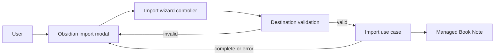

## Context

The current import flow presents a separate review state after the user selects a destination. That state repeats the selected provider, book, destination, and annotation count before the user can start the write. The controller already holds a prepared **Import Snapshot** and destination selection, while the modal renders controller state and the import use case writes the **Managed Book Note**.

The active ADRs require the UI to remain outside the hexagonal application core and preserve safe managed-note updates. This change affects only the wizard flow; it does not alter provider retrieval, snapshot construction, note ownership, or persisted metadata.

## Goals / Non-Goals

**Goals:**

- Remove the final review and confirmation boundary from the import flow.
- Start an import from the destination step after validation succeeds.
- Preserve existing validation, error recovery, cancellation, completion, and managed-note update behavior.
- Keep the modal as the UI adapter and the wizard controller as the workflow owner.

**Non-Goals:**

- Changing provider selection, book selection, destination defaults, or note rendering.
- Changing **Import Snapshot** retrieval or **Managed Book Note** ownership rules.
- Adding bulk imports, background imports, or another confirmation mechanism.

## Decisions

### Replace the review state with direct import from destination

The destination state's primary action will validate and sanitize the destination, then start the existing import use case immediately. The wizard will remove the review state, its transition method, and review-specific error step. The modal will remove the review renderer and progress label segment, and relabel the destination CTA from `Review` to `Import`.

Alternative considered: keep an unrendered review state between the destination and import states. This was rejected because it retains obsolete workflow state and makes errors and retries less direct.

### Remove the confirmation gate from the import request

The import use case will no longer require a caller-provided confirmation flag or emit a confirmation-required error. The destination action is the single intentional import trigger, so retaining a confirmation contract that no caller can decline would be misleading.

Alternative considered: keep the confirmation flag and always pass `true`. This was rejected because it leaves dead behavior and an unreachable error category in the core contract.

### Recover execution failures to the destination state

When a direct import fails, the error state will retain the validated destination as its back state. Retryable failures will rerun the direct import; non-retryable failures let the user return to and correct the destination. Destination conflicts continue to return directly to the destination state.

Alternative considered: add a new intermediate retry state. This was rejected because the existing error state already provides retry, back, and cancel actions.

## Risks / Trade-offs

- [Users have one fewer chance to notice an incorrect destination] -> The destination remains editable and the action is explicitly labeled `Import`.
- [An invalid destination could enter the write path] -> Validate and sanitize the destination before transitioning to the importing state.
- [Removing review state could regress error navigation] -> Update controller tests for retryable, non-retryable, and destination-conflict failures from direct import.
- [Removing the confirmation contract could affect callers] -> Update all request construction and error-category tests in the repository; no external API exposes this contract.

## Migration Plan

Release this as a normal plugin update. The change has no persisted data or migration requirement. If a regression is found, rollback to the previous plugin release restores the review step without modifying existing **Managed Book Note** content.

## Open Questions

None.
