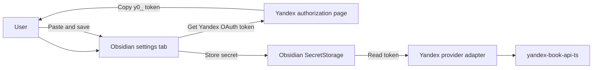

## Context

Yandex Books currently uses the shared provider-settings control in `BookHighlightsSettingsTab`. It accepts a generic secret, while the Yandex client consumes an already-issued token and **Provider Credential** storage keeps that value in Obsidian SecretStorage. The upstream client does not obtain, refresh, or store OAuth tokens.

The existing ADRs remain in force. This change preserves the Obsidian adapter boundary in ADR-0005, compile-time provider registration in ADR-0006, upstream Yandex client ownership in ADR-0003, and SecretStorage for credentials in ADR-0002.

## Goals / Non-Goals

**Goals:**
- Make the Yandex Books control unambiguously request a **Yandex OAuth token**, whether or not a previous token is configured.
- Explain the minimal authorization, copy, paste, and save sequence in the settings UI.
- Open the documented Yandex authorization URL from a settings action.
- Preserve the existing secret-storage and token-redaction behavior.

**Non-Goals:**
- Implement an OAuth callback, code exchange, automatic token capture, refresh-token handling, or automatic token renewal.
- Change the upstream Yandex client, provider-neutral core contracts, or existing credential-storage implementation.
- Generalize the Yandex authorization flow into a configuration framework for future providers.

## Decisions

### Keep the change in the Obsidian settings adapter

Render Yandex-specific guidance and the authorization action only when the registry entry is Yandex Books. Keep the current generic save, clear, and connection-test controls unchanged. This is a localized UI concern, and it avoids expanding provider-neutral contracts for a single provider.

Alternative considered: add authorization metadata to every provider contract. Rejected because no second provider has this requirement, and it would introduce a premature configuration abstraction.

### Use the documented implicit-token authorization URL

Keep the authorization URL as a named constant in the settings adapter and open it with Obsidian's supported external-URL mechanism. The settings text tells the user to authorize Yandex, copy the `y0_...` access token from the resulting browser URL, and paste it into the field.

Alternative considered: link only to the dependency documentation. Rejected because opening the direct authorization page removes a navigation step while the in-plugin text still explains the required manual copy and paste.

### Require manual token paste after authorization

Do not create a redirect listener or accept tokens from a browser URL. The authorization result is a URL fragment in the user's browser, and the plugin does not have an OAuth client registration or callback transport. The user controls the copied **Yandex OAuth token**, while the plugin continues to save it through the existing **Provider Credential** store.

Alternative considered: implement a complete OAuth flow. Rejected because it requires a registered callback, mobile and desktop redirect handling, and a security model beyond this settings improvement.

### Verify behavior at the settings boundary

Extend the settings-tab tests to assert the placeholder, instructions, authorization action target, redaction after a token is saved, and the existing save behavior. Mock the external URL opener rather than performing browser navigation during tests.

Alternative considered: test the flow through the Yandex client. Rejected because token acquisition is outside that upstream client and browser navigation belongs to the Obsidian UI adapter.

## Risks / Trade-offs

- [The documented Yandex authorization URL or its response format changes] -> Keep the URL and instructions in one named location and update them with the upstream package documentation.
- [A user mistakes the browser URL for the token value] -> State that only the `y0_...` value should be copied and retain the password input type.
- [External URL opening differs by Obsidian platform] -> Use the Obsidian-supported external-URL mechanism and cover the invocation with a settings-tab test.
- [A future provider needs guided authorization] -> Reassess provider configuration metadata then rather than coupling a generic contract to one provider today.

## Migration Plan

No persisted-data migration is required. Existing saved Yandex credentials remain in their SecretStorage key and are only relabeled in the UI as Yandex OAuth tokens.

Release the settings update with focused unit tests. Rollback consists of restoring the prior settings rendering; saved credentials remain unaffected because their storage key and format do not change.

## Open Questions

None. The authorization URL, manual paste flow, and no-callback boundary are decided by the upstream package documentation and the change scope.
