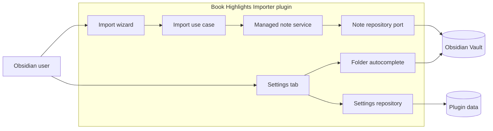

## Context

The settings tab currently exposes a plain text field and a Save button for the default folder. It persists a full `ImportSettings` value directly, while a successful import separately loads and saves the same value to update `lastFolder`. The import core validates a destination path and delegates note writes to the **Note Repository Port**, but that port cannot create folders.

The user experience requires a debounced, button-free default-folder setting, suggestions from existing vault folders, and creation of a missing **Vault-relative folder** hierarchy immediately before an import writes a **Managed Book Note**. The active ADRs keep Obsidian APIs outside the hexagonal core (ADR-0005), preserve managed-note safety (ADR-0004 and ADR-0008), retain provider architecture boundaries (ADR-0003, ADR-0006, and ADR-0007), and keep secrets out of normal settings (ADR-0002). ADR-0001 is superseded by ADR-0005 and ADR-0006; no in-force ADR needs revision.

The plugin remains the only deployable unit. Folder autocomplete is an Obsidian UI concern, while creating folders remains a driven operation behind the existing note boundary.

## Goals / Non-Goals

**Goals:**

- Replace the default-folder Save button with a debounced automatic save.
- Offer matching existing vault folders, including nested paths, without rejecting a valid new path.
- Prevent delayed settings writes from overwriting a newly persisted last successful folder.
- Create missing destination folders before a new **Managed Book Note** write.
- Preserve safe-path validation, managed-note ownership checks, and retry behavior.

**Non-Goals:**

- Add folder autocomplete to the import wizard destination field.
- Change default-folder versus last-successful-folder precedence.
- Persist a folder index, create folders when settings are edited, or delete empty folders on failed imports.
- Alter provider retrieval, rendering, frontmatter, or managed-section behavior.

## Decisions

### Use an Obsidian-local folder suggestion helper

The settings tab will attach a small autocomplete helper to its default-folder `TextComponent`. The helper will read the current vault folder collection, exclude the vault root, normalize candidate paths to slash-separated vault-relative values, and show case-insensitive matches as the user types. Selecting a suggestion updates the normal text input path, so it follows the same debounce and persistence behavior as manually entered text. A typed value remains unchanged when it has no matching folder.

This helper stays in `src/obsidian/` and depends directly on the Obsidian Vault. It does not add a core port because folder discovery is presentation data, not import policy, and it will be cleaned up when the settings tab is hidden or rerendered.

Alternative considered: add a folder-listing port to the core. This was rejected because no core use case needs to make a decision from the list; it would expose Obsidian UI data through the application boundary solely for one control.

### Debounce and serialize settings updates

The settings tab will schedule a save 300 ms after the most recent input change, canceling the prior timer on another change, rerender, or tab hide. It will retain a render generation and a save generation so stale load/save completions cannot update the current control or status. Saves will show an inline saved or failed status and never reintroduce a Save button.

`SettingsRepositoryPort` will replace full-document caller-owned saves with a serialized update operation that receives the latest `ImportSettings`, persists the returned value, and resolves to that value. The settings tab will update only `defaultFolder`; the import use case will update only `lastFolder` after a committed note write. The Obsidian settings adapter will queue these updates, so a delayed default-folder save cannot overwrite a last-folder update based on stale loaded settings.

Alternative considered: load settings immediately before every autosave and call the existing `save` method. This reduces stale reads but cannot serialize an import update that interleaves between the load and save calls.

### Create missing folders through the note repository

`NoteRepositoryPort` will gain an `ensureFolder(folder)` operation. The Obsidian adapter will normalize the requested **Vault-relative folder**, then create missing path segments in order using the Vault API. It will treat a concurrent creator as success only after confirming that the path now resolves to a folder, and reject a file occupying any required segment.

The managed-note service will render and validate the snapshot first, inspect the target path, and call `ensureFolder` only when the target note is missing. It will call `create` only after folder creation succeeds. Existing matching **Managed Book Note** updates continue to use the current atomic `process` call without a folder-creation operation.

Alternative considered: create folders in the import wizard. This was rejected because the UI would duplicate destination-write policy and could create folders before snapshot rendering or note safety validation succeeds.

### Represent folder-creation failure as retryable destination unavailability

The core result union will add `destination-unavailable`. Any `ensureFolder` failure maps to this outcome before a note write. The wizard will display a destination-specific message, preserve the validated destination as the back state, and expose Retry. It will not report `destination-conflict`, which is non-retryable and means an existing note cannot be updated safely.

Alternative considered: reuse `provider-unavailable` or `destination-conflict`. These alternatives would give users an inaccurate message or omit the required retry action.

## Risks / Trade-offs

- [A burst of input produces stale asynchronous completions] -> Cancel pending timers and gate status updates on render and save generations.
- [Default-folder and last-folder writes race] -> Serialize repository updates around the latest persisted settings value.
- [The vault changes while autocomplete is open] -> Read current vault folders for each query and treat suggestions as advisory; a selected or typed path is still validated at import time.
- [Folder creation fails because of permissions, sync state, or an intervening file] -> Return `destination-unavailable`, do not create or update a note, and offer retry.
- [Folder hierarchy creation succeeds but note creation later fails] -> Leave created empty folders in place; folder deletion would be unsafe because the plugin cannot know whether another actor used them.
- [Tests mock Obsidian controls and Vault APIs] -> Extend the focused settings-tab and note-repository fakes rather than introducing a new UI framework or package.

## Migration Plan

Release as a normal plugin update. Existing version-1 settings remain valid because `defaultFolder` and `lastFolder` retain their stored representation; only write coordination changes. Existing users keep their configured default and last successful destination. No folders are created until an import targets a missing valid path.

Rollback to the prior plugin version leaves settings and any created folders intact. It does not alter **Managed Book Note** content or the existing destination precedence rule.

## Open Questions

None.
