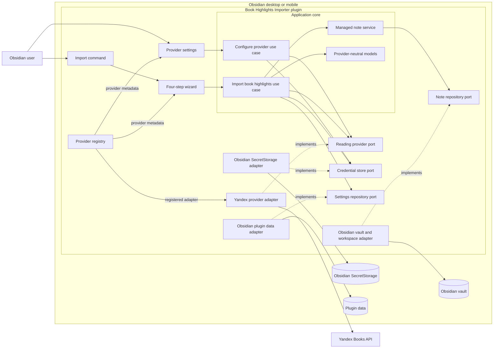
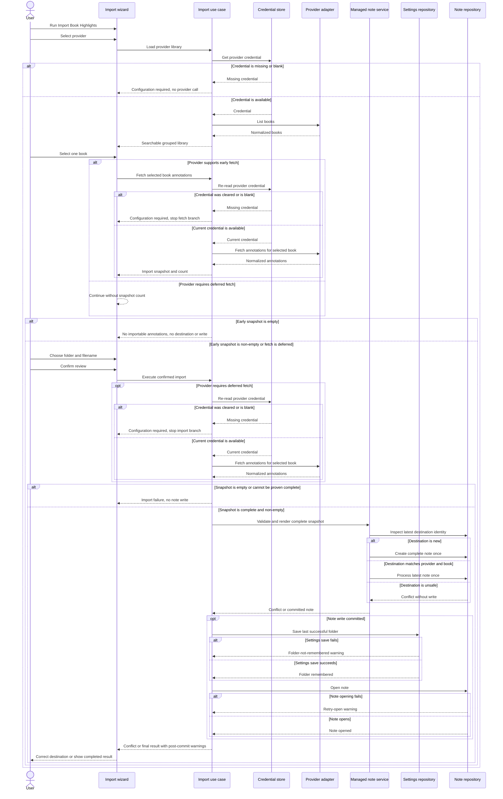

## Context

The repository currently contains product intent and OpenSpec artifacts but no Obsidian plugin implementation. This change establishes the plugin scaffold and the first complete import path for Yandex Books while preserving a boundary for later LitRes and other integrations.

The plugin must run in Obsidian desktop and mobile, use Obsidian 1.11.4 or newer for SecretStorage, and keep raw OAuth tokens out of ordinary plugin data. One command opens a four-step wizard, imports one selected book, and creates or safely refreshes one **Managed Book Note**.

The supplied `yandex-book-api-ts-0.0.0.tgz` is an ESM package that declares Node.js 20 or newer. Its distributed client uses global `fetch`, accepts an OAuth token, exposes `getProfile()`, offset-based `getMyLibrary()`, page-based `getUserQuotes()`, and typed API errors. The package does not expose transport injection through `YandexBookClient`, does not obtain or refresh credentials, and does not expose chapter metadata or a per-book quote endpoint.

No files exist under the repository-level `adr/` directory, so there are no in-force ADRs constraining this design. The approved diagram style is a Mermaid hybrid: lightweight C4-inspired boundaries plus a dynamic sequence for the import flow.

Stakeholders are Obsidian users importing their own reading data, plugin maintainers adding future providers, and the maintainer of `yandex-book-api-ts`, who will supply a new package when compatibility changes are required.

Source artifacts are `proposal.md` for intent and the three capability files under `specs/` for required behavior.

Compatibility conditions before provider implementation proceeds:

- Yandex pagination can be proven complete by a short final page and stable page contents.
- The authenticated profile exposes a non-blank `login` that `getUserQuotes()` accepts consistently. Live verification found no usable `profile.uuid`, and the numeric `profile.id` returned `404 NotFound` from both `getUser()` and `getUserQuotes()`.
- Importable quotes identify their owning book by `quote.book.uuid`.
- Obsidian SecretStorage and the supplied package behave consistently enough on desktop and mobile to meet the shared feature contract.

## Goals / Non-Goals

**Goals:**

- Build a desktop- and mobile-capable Obsidian community plugin using TypeScript and Obsidian-native APIs.
- Isolate the provider-neutral import behavior from Yandex and Obsidian implementation details.
- Make each built-in **Reading Provider** independently configurable and testable.
- Normalize provider books and **Book Annotation** records before sorting, rendering, or writing.
- Use one guided modal with explicit state, back navigation, early fetch when supported, and no writes before confirmation.
- Generate deterministic chapter-first Markdown when structure exists and a book-ordered fallback when it does not.
- Re-import by replacing only namespaced frontmatter and the matching **Managed Section**.
- Perform one vault create or process operation only after the complete **Import Snapshot** has been validated and rendered.
- Verify the Yandex package in real Obsidian desktop and mobile runtimes before building dependent integration behavior.

**Non-Goals:**

- LitRes or any provider other than Yandex Books in the first release.
- A runtime third-party adapter API, package marketplace, or dynamically loaded provider code.
- Multi-book import, background synchronization, scheduled jobs, or incremental per-annotation merge.
- Built-in Yandex OAuth acquisition or refresh.
- Exact chapter reconstruction when the provider does not supply chapter metadata.
- User-defined Markdown templates, cover downloads, audiobook annotations, or public/social annotations.
- Patching, forking, or duplicating `yandex-book-api-ts` inside the plugin.

## Decisions

### Use a hexagonal plugin architecture

The application core owns provider-neutral models, use cases, note policy, and ports. Obsidian UI and storage integrations are driving and driven adapters around that core. The Yandex implementation is a **Provider Adapter** that translates package models and errors at one boundary.



- The plugin is the only deployable unit; components in the diagram are modules inside it.
- Dependencies point toward application ports and models. Provider package types do not cross into the core.
- The **Provider Registry** is populated at plugin startup from compiled-in registrations. Adding LitRes means adding another registration and adapter, not another import workflow.
- Core tests require neither Obsidian nor network access.

Alternatives considered:

- Layered services would require fewer initial interfaces but allow Obsidian and provider details to leak into shared import behavior.
- Provider-owned vertical slices would ship Yandex quickly but duplicate settings, wizard, rendering, and note safety for every provider.
- Runtime adapter loading would add versioning, trust, and compatibility contracts before there is a demonstrated external adapter ecosystem.

### Define narrow provider and storage ports

The core consumes interfaces shaped around user behavior rather than Yandex endpoints. A provider operation receives a credential only for the duration of a call; adapters do not retain credentials in long-lived fields.

```ts
interface ReadingProviderPort {
  readonly id: string;
  readonly displayName: string;
  readonly annotationFetch: "early" | "deferred";
  testCredential(credential: string): Promise<void>;
  listBooks(credential: string): Promise<readonly ProviderBook[]>;
  fetchAnnotations(
    credential: string,
    book: ProviderBook,
  ): Promise<readonly BookAnnotation[]>;
}

interface CredentialStorePort {
  get(providerId: string): string | null;
  set(providerId: string, credential: string): void;
  clear(providerId: string): void;
}

interface NoteRepositoryPort {
  inspect(path: string): Promise<DestinationState>;
  create(path: string, content: string): Promise<void>;
  process(path: string, update: (current: string) => string): Promise<void>;
  open(path: string): Promise<void>;
}
```

`ProviderBook` contains provider ID, stable book ID, title, authors, normalized reading status, optional progress, and optional source URL. `BookAnnotation` contains optional highlighted text, optional comment, optional provider source key, optional chapter path and order, optional location/progress, creation time, and a stable input index. The core combines the exact selected `ProviderBook` with the returned annotations to construct an **Import Snapshot**; the adapter does not reload or hide book state.

Alternatives considered:

- Passing `LibraryCard` and `Quote` through the application would couple sorting, UI, and rendering to Yandex.
- A broad generic API client port would mirror HTTP instead of expressing plugin behavior.
- Retaining an authenticated client globally would increase credential lifetime and make replacement harder to reason about.

### Compose built-in providers at startup

Each provider module contributes its provider adapter and Obsidian settings section to the startup wiring. The **Provider Registry** exposes immutable registrations to settings and the wizard. The core knows only the provider port; provider-specific settings rendering remains in the Obsidian UI layer.

This avoids a lowest-common-denominator configuration schema. Yandex needs one secret token today, while a future provider can add its own non-secret and secret controls without changing the import use case.

Alternative considered: define a dynamic JSON settings schema for all providers. It would reduce provider-specific UI code but adds a schema language before configuration patterns are known.

### Use Obsidian SecretStorage for provider credentials

The minimum Obsidian version is 1.11.4. A provider-specific lowercase secret ID, such as `book-highlights-importer-yandex-books-token`, identifies the Yandex OAuth **Provider Credential**. The UI accepts a token in a temporary masked input, writes it directly to SecretStorage, clears the input, and subsequently shows only configured/not-configured status.

Ordinary plugin data contains only non-secret settings:

```ts
interface PluginSettings {
  version: 1;
  defaultFolder: string;
  lastFolder?: string;
}
```

The public SecretStorage contract has no delete method. `clear()` writes an empty value and treats blank values as missing. Connection testing calls `getProfile()` instead of `testToken()` because `testToken()` converts all failures to `false`; direct error mapping is required to distinguish rejected authentication from provider unavailability.

Alternatives considered:

- `loadData()` would store a raw token with ordinary settings.
- Plugin-controlled encryption would need a separately protected key or a master passphrase after each app restart.
- Prompting on every import would avoid persistence but make the normal workflow unnecessarily repetitive.

### Drive one modal with an explicit state machine

The Obsidian `Modal` uses native controls and one state object rather than chained modals or a frontend framework. The state machine has Provider, Book, Destination, Review, Importing, and Error states, with transient LoadingLibrary and LoadingAnnotations states.

Changing provider invalidates selected book, annotation snapshot, and review data. Changing book invalidates the annotation snapshot and review data. Back navigation preserves only still-compatible selections. Cancel closes the modal and performs no note operation.

Every asynchronous provider request captures a monotonically increasing request generation plus the selected provider and book IDs. Provider change, book change, Back to an invalidating step, retry, and cancel increment the generation. A completion updates wizard state only when generation and identities still match; stale responses are discarded because the current package cannot abort requests.

The import use case reads the current credential immediately before every provider operation. It does not retain the credential used for library loading. A replacement credential is used by the next operation; a cleared or blank credential stops that branch and returns the wizard to configuration without a provider call.



Alternatives considered:

- Chained modals simplify each screen but make Back behavior and shared error state fragile.
- One compact form hides asynchronous provider loading and produces crowded mobile layouts.
- React would add runtime and build complexity without a need for a separate component ecosystem in the initial plugin.

### Adapt Yandex through the supplied package only

The Yandex adapter imports `YandexBookClient` from the checked-in file dependency and owns all package-specific mapping.

Credential testing uses `getProfile()` and maps `UnauthorizedError` to authentication failure. A resolved `undefined` profile or blank `profile.login` is an unusable-provider-response failure, not a successful test. Other `ApiError` values become provider rejection or unavailability errors without exposing safe details unless explicitly allowlisted. Unknown errors become an unavailable-provider error and are never logged with the credential.

Library loading calls `getMyLibrary(pageSize, offset)` until a short page is returned. It tracks page signatures and normalized book IDs, rejects a full repeated page or a page that makes no progress, and imposes a documented maximum as protection against an inconsistent upstream response. Reaching any guard is a hard incomplete-data error; the adapter never returns a prefix as a complete library. A `LibraryCard` without a stable text-book UUID is excluded with a diagnostic count; audiobook and comic-only cards are outside scope.

The adapter normalizes provider state and reading progress into `in-progress`, `finished`, `unread`, or `unknown`. The mapping table is implementation-blocking until the compatibility spike records sanitized examples and confirms the progress scale. After that gate, unknown provider state values remain `unknown`; they are not guessed. The core presents groups in the specified order: in-progress, finished, then unread/unknown.

Yandex supports early fetching only after the compatibility spike proves identity and pagination behavior. The adapter calls `getProfile()` and requires a non-blank `profile.login`, the identifier verified to satisfy `getUserQuotes(userId)`. It does not fall back to `profile.id` or `profile.uuid`: the numeric ID returned `404 NotFound` from user endpoints, and the verified profile supplied no usable UUID. If the login no longer satisfies `getUserQuotes(userId)`, implementation stops for an upstream authenticated-user quotes operation.

Quote loading pages through `getUserQuotes(profile.login, page, pageSize)` until a short page. It tracks page signatures. With a verified stable source key, repeated keys are accepted only when their normalized records are identical and one copy is retained; conflicting values for one key fail the snapshot. Without such a key, identical-looking records within one page are preserved, but the same normalized fingerprint appearing on different pages is an ambiguous overlap and hard-fails the snapshot. A repeated full page, no-progress page, malformed pagination, or the documented maximum also produces a hard incomplete-snapshot error. No partial **Import Snapshot** reaches note rendering.

The authoritative quote association is `quote.book.uuid === selectedBook.bookId`. An otherwise importable quote without `quote.book.uuid` makes the snapshot incomplete and fails the import rather than being silently dropped or attributed from another field. Account-wide quote pages are held only for the current wizard run and discarded when the modal closes or the selected provider changes.

Quote mapping uses `content` as highlighted text, `comment` as the attached user comment, `progress` as the primary reading-order position, and CFI/XPath fields as optional display or tie-breaking location only after their ordering semantics are verified. Records with neither non-blank content nor non-blank comment are excluded. If filtering leaves zero annotations, the import stops before destination selection for early fetch or before note rendering for deferred fetch.

The package currently uses global `fetch` internally and does not expose the existing transport injection capability through its public client constructor. Compatibility must therefore be tested in Obsidian desktop and mobile before dependent UI work. If either runtime fails because of CORS, headers, Node assumptions, or fetch behavior, implementation stops and reports the exact incompatibility so a replacement package can expose the required fix. The plugin will not copy endpoints or monkey-patch the bundle.

Alternative considered: call the Yandex API directly from the plugin. This would duplicate the maintained library and violate the agreed ownership boundary.

### Normalize before filtering, sorting, and rendering

The Yandex adapter strips unsupported markup, normalizes line endings, trims blank values, and maps source values into immutable core models. Provider text is treated as untrusted input. The Markdown renderer escapes YAML values and recognizes managed markers only on exact standalone lines, preventing imported content from creating a false marker boundary.

The core sorts annotations by verified provider section order, then numeric reading progress or location order, then creation time, then stable input index. It never alphabetizes chapter titles or assumes lexical CFI order. When section metadata is missing, the renderer uses one `## Highlights` section and retains the best available progress or location for each item.

The fixed rendering grammar is covered by golden tests. A representative managed body is:

```md
# The Master and Margarita

## Chapter 2: Pontius Pilate

> Cowardice is the most terrible of vices.

> [!note] Comment
> Return to this idea after finishing the book.

_Progress: 34%_

> [!note] Comment
> Compare this passage with the ending.

_Location: 41%_
```

Highlighted text is a blockquote. An attached or comment-only annotation is an Obsidian note callout. The best available location follows the annotation in italic metadata. Chapter headings appear only when supplied by the provider.

A provider chapter path maps its first segment to `##`, then increases one heading level per segment through `######`. Segments deeper than five levels are joined with ` / ` into the final level. Between adjacent annotations, the renderer finds the common path prefix and emits changed descendant headings. When the target path is a strict ancestor of the previous path, it re-emits the target ancestor heading to reset Markdown scope before rendering the annotation. Heading and book-title values are converted to single-line plain text, control characters are removed, whitespace is collapsed, and Markdown-sensitive heading characters are escaped. Provider section order, never alphabetic title order, determines when branches are emitted.

Alternative considered: render directly from API responses in fetch order. This would make note structure provider-dependent and make deterministic re-import difficult to test.

### Own namespaced frontmatter and one managed section

New notes contain namespaced frontmatter and one marker-delimited body region. The plugin owns only these frontmatter keys:

- `book-highlights-provider`
- `book-highlights-book-id`
- `book-highlights-title`
- `book-highlights-authors`
- `book-highlights-status`
- `book-highlights-source-url`
- `book-highlights-imported-at`

The body marker format is versioned and identity-bearing:

```md
<!-- book-highlights-importer:start version=1 provider=yandex-books book-id=book-uuid -->
...generated title, metadata, chapters, highlights, comments, and locations...
<!-- book-highlights-importer:end -->
```

Marker attributes use canonical percent-encoding before insertion and strict decoding during parsing. Marker parsing requires supported version `1`, exactly one matching start/end pair on standalone lines, known attributes only, and agreement between decoded marker identity and frontmatter. An unsupported version, invalid encoding, different identity, missing identity on an existing file, malformed markers, or multiple matching regions is an unsafe destination and produces no write.

For a new note, the adapter serializes the complete frontmatter and managed body before one `Vault.create()` call. For an existing matching note, it uses `Vault.process()` so parsing, validation, frontmatter merge, managed-section replacement, and serialization operate on the latest file contents in one update callback. Each re-import reconstructs the full owned frontmatter set, removing formerly owned optional fields that are absent from the new snapshot. Obsidian YAML parsing and serialization may normalize frontmatter formatting, but all non-`book-highlights-` values are preserved.

The renderer replaces the complete snapshot rather than merging individual annotations. This naturally removes records no longer returned by the provider and avoids depending on a Yandex quote ID that the package does not expose reliably.

Alternatives considered:

- Overwriting the whole note would delete user-authored Markdown and frontmatter.
- Appending on every import would duplicate annotations.
- Per-annotation merge would need durable source IDs and conflict semantics that are not available.
- Accepting an existing note without plugin identity would risk modifying an unrelated user note.

### Keep destination policy provider-neutral

Non-secret settings store the configured default folder and last successful destination folder. The most recent folder takes precedence; the configured default is used when no prior destination exists. The default filename is sanitized `Author - Title.md` and remains editable. Vault paths are normalized and must remain inside the vault.

The destination is inspected only after provider data is ready for validation. Rendering completes before create/update. A successful `Vault.create()` or `Vault.process()` is the import commit point. Only after that point does the import use case persist `lastFolder`, open the note, and return the imported count plus warnings. A settings-save failure reports only that the folder was not remembered. A note-opening failure reports a retry-open action. Neither post-commit warning relabels or rolls back the completed import. Failures before the commit point map to retry, settings, destination correction, or cancel actions without exposing credentials or changing a note.

### Use focused automated and runtime verification

Vitest covers core use cases, provider capability branching, request-generation stale-response rejection, group order, search behavior, filtering, deterministic sorting, Markdown rendering, marker parsing, unsupported marker versions, frontmatter preservation and owned-field removal, filename conflicts, and no-write failures. Golden-note tests cover new-note and re-import output. Property-oriented cases exercise arbitrary user text around markers and frontmatter values.

Yandex adapter tests use sanitized fixtures for missing profile identity, library cards, quote-to-book association, zero annotations, pagination completion, duplicate or repeated pages, safety-limit exhaustion, unknown states, and error mapping. An opt-in smoke test reads `YANDEX_BOOKS_OAUTH_TOKEN` from the environment and does not print the token or persist live responses.

Manual release checks run in actual supported Obsidian desktop and mobile versions. They cover SecretStorage save/test/replace/clear, library pagination and grouping, early annotation fetch, destination defaults, initial import, safe re-import, conflict rejection, cancellation, network failure, and opening the result.

## Risks / Trade-offs

- [The Yandex package declares Node.js 20 and uses global `fetch`, while Obsidian mobile is a browser-like runtime] -> Run a desktop/mobile compatibility spike first; stop and request an upstream package update for any incompatibility.
- [The unofficial Yandex API or response shapes may change] -> Keep endpoints behind one adapter, reject malformed required identity fields, maintain sanitized fixtures, and run opt-in smoke tests.
- [`getUserQuotes()` returns account-wide pages rather than selected-book pages] -> Fetch only after book selection, paginate sequentially with loop guards, hard-fail incomplete pagination, filter immediately, show progress, and cache only for the wizard session.
- [Yandex quote models do not provide chapter hierarchy] -> Use progress-based book order and one Highlights section; never invent chapter names.
- [Provider state values and progress scale are not documented by the package] -> Confirm them with sanitized live samples and map unknown values to `unknown` rather than guessing.
- [Obsidian SecretStorage does not publicly document encryption, synchronization, deletion, or platform guarantees] -> Treat credentials as per-device, test both platforms, store no raw fallback, and clear by replacing the value with an empty secret.
- [YAML serialization may alter formatting or comments] -> Preserve all user-owned values, document formatting normalization, and limit ownership to namespaced fields.
- [Users can manually damage managed markers] -> Require exact, unambiguous markers and fail without a write when validation fails.
- [Obsidian does not provide a cross-file transaction] -> Update only one note per import, construct all data first, and use one `Vault.create()` or `Vault.process()` operation.
- [A fixed Markdown format limits customization] -> Keep output deterministic and safe for the first release; evaluate templates only after managed-note behavior is stable.

## Migration Plan

There is no existing plugin code or persisted state to migrate.

1. Add the Obsidian plugin scaffold, minimum app version, TypeScript build, test tooling, and file dependency on the supplied Yandex package.
2. Implement the provider-neutral models, ports, use cases, and note policy with unit tests.
3. Run the Yandex package compatibility spike in desktop and mobile. Stop for an upstream package update if either runtime fails.
4. Implement Obsidian SecretStorage, plugin data, vault, workspace, settings, command, and wizard adapters.
5. Implement and fixture-test the Yandex adapter, then connect it through the provider registry.
6. Complete automated, environment-gated, and manual acceptance verification before distribution.

The first settings payload uses schema version `1`. Disabling or uninstalling the first release leaves generated notes as ordinary Markdown. Users should clear provider credentials before uninstalling if they want the stored secret value blanked. First-release rollback consists of disabling or uninstalling the plugin; existing notes do not require conversion.

## Resolved Questions

For the verified account, `getProfile().login` is accepted by `getUserQuotes(userId)`. The numeric `profile.id` returns `404 NotFound`, and no usable `profile.uuid` is returned, so the adapter uses only the non-blank login for account-wide quote retrieval.

A sanitized live sample returned quote page counts `[20, 20, 0]`, repeated the first page consistently, and supplied `quote.book.uuid` for all 40 importable records. All 40 records supplied `itemUuid`, but only three values were unique, so `itemUuid` is not a quote source key; pagination uses normalized fingerprints and cross-page overlap rejection instead. The library sample contained `reading`, `finished`, and `pending` states. Only `reading` to `in-progress` and `finished` to `finished` are proven mappings; `pending` remains `unknown`. No numeric `readingProgress` values were observed, so no progress scale is defined. Sanitized fixture data is stored in `tests/fixtures/yandex/runtime-observations.json`.

## Open Questions

- Do Yandex REST requests made by the package's global `fetch` succeed in both Obsidian desktop and mobile? A failure requires an upstream release that exposes fetch injection or another compatible transport.
- Does writing an empty value through SecretStorage provide the expected Clear behavior on both platforms? If not, the minimum Obsidian version or settings interaction must be revisited before implementation continues.
- ADR review should determine whether the hexagonal provider boundary, SecretStorage requirement, and upstream-package ownership warrant separate durable repository-level ADRs. There are no existing ADRs to supersede.
